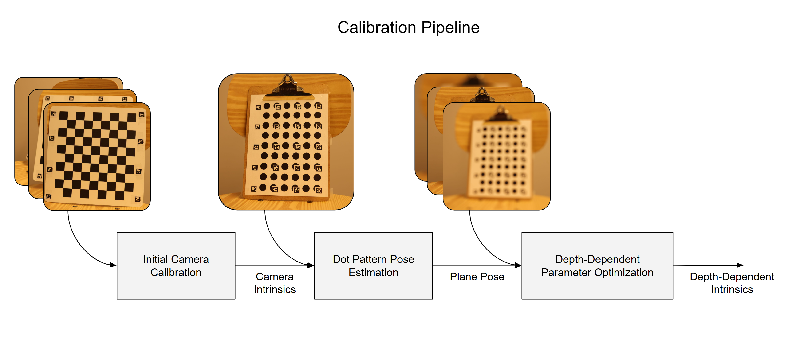

# Focus Breathing Calibration from a Focus Stack

This project attempts to calibrate a len's focal length from an initial set of standard checkerboard calibration images and a focus stack of a custom calibration pattern.

## Project Structure

```
.
├── checkerboard_singles/        # Single shots of calibration checkerboard
├── checkerboard_stacks/         # Focus stacks of calibration checkerboard
├── colmap/                      # Colmap reconstructions
|   └── room/                    # Reconstructions of "room" scene
|   |   └── images/              # Shots of room scene
|   └── tabletop/                # Reconstructions of "tabletop" scene
|       └── images/              # Shots of tabletop scene
├── dot_patterns/                # Dot calibration patterns
├── dot_stacks/                  # Photos of dot calibration patterns
├── optimized_calibrations/      # Mitsuba optimized depth-dependent camera parameters
├── analysis.py                  # Analysis scripts and visualizations
├── calc_pose.py                 # Dot stack pose estimation
├── calibrate_depths.py          # Camera calibration for checkerboard singles and checkerboard stacks
├── colmap.py                    # Colmap wrapper
├── common.py                    # Helper functions and constants
├── depthGroup.py                # Class representing images from checkerboard stacks with the same depth
├── imgSet.py                    # Class representing a dot stack
├── optimize_batch.py            # Mitsuba optimizer for depth-dependent camera calibration
└── reconstruction_test.py       # Colmap scene reconstruction tests
```

## Setup

### Tools

This project requires Python 3.12 and Colmap.

#### Python
Install [Python 3.12](https://www.python.org/downloads/) if not already installed\
Create a venv in the project folder with `py -m venv .venv`\
Activate the venv with `.venv/Scripts/activate` (This must be done every time the project is opened)\
Install required packages with `pip install -r requirements.txt`

#### Colmap
Install [Colmap](https://github.com/colmap/colmap/releases/tag/4.0.3) and add it to the Path variable (or pass its executable path as an argument when constructing `colmapDB`)

### Dataset

The dataset can be downloaded from [here](https://1sfu-my.sharepoint.com/personal/eakbarib_sfu_ca/_layouts/15/onedrive.aspx?id=%2Fpersonal%2Feakbarib%5Fsfu%5Fca%2FDocuments%2Fcheckerboard%20%26%20colmap&ga=1)

To add the dataset to the project:

Move all files from `{DATASET FOLDER}/Single Focus Calibration/` to `{PROJECT FOLDER}/checkerboard_singles/`\
Move all files from `{DATASET FOLDER}/Focus Stack Calibration/` to `{PROJECT FOLDER}/checkerboard_stacks/`\
Move all files from `{DATASET FOLDER}/bokeh_calib_photos/` to `{PROJECT FOLDER}/dot_stacks/`\
Move all files from `{DATASET FOLDER}/COLMAP_ROOM/` to `{PROJECT FOLDER}/colmap/room/images`\
Move all files from `{DATASET FOLDER}/COLMAP_SCENE/` to `{PROJECT FOLDER}/colmap/tabletop/images`

## Primary Pipeline



#### Initial Camera Calibration and Pose Estimation

Run `py init.py --calibrate-cameras --take-poses` to take the initial camera calibration and pose estimations.\
Also pass `--calibrate-do-stacks` if you plan on running `analysis.py` later.

#### Depth-Dependent Camera Calibration

Run `py optimize_batch.py`
**Note: this uses a Cuda variant of Mitsuba, so a compatible Nvidia gpu is required.

## Analysis

Run `py init.py --calibrate-cameras --calibrate-do-stacks` if you haven't already.

#### Plot Baseline Calibration Parameters Against Depth

Run `py analysis.py --focus-breathing`

#### Compare Optimized Parameters to Checkerboard Stack Estimates

Run `py analysis.py --optim-results`\
Add the `--optim-show-baseline` flag to display the baseline camera calibrartion estimated from the checkerboard stacks\
Add the `--optim-show-interpolated` flag to apply cubic interpolation

#### Compare Colmap Results

Run `py reconstruction_test.py` to generate sparse and dense Colmap reconstructions\
Dense reconstructions can be found at `colmap/{SCENE NAME}/{NAME}_dense/meshed.ply`